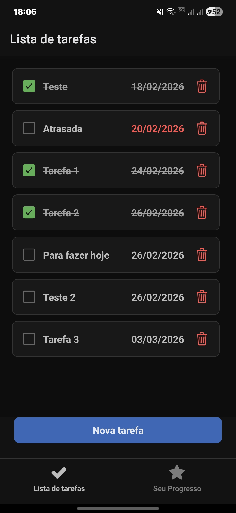
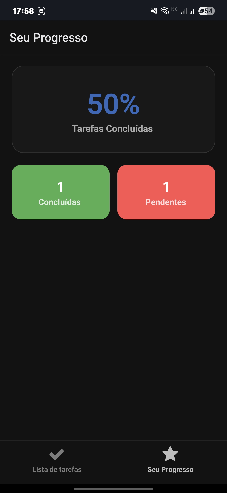
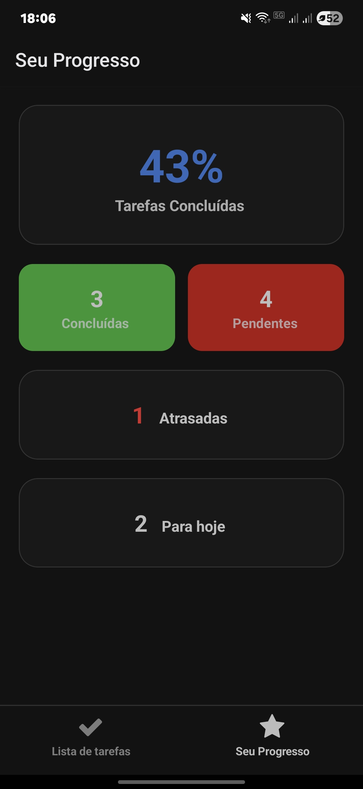

# **Aplicativo de lista de tarefas desenvolvido com React**
Permite a inclusão e exclusão de tarefas, que podem ser marcadas como concluídas. Também exibe o número de tarefas realizadas e pendentes, com a porcentagem de itens concluídos.

  
  
  

