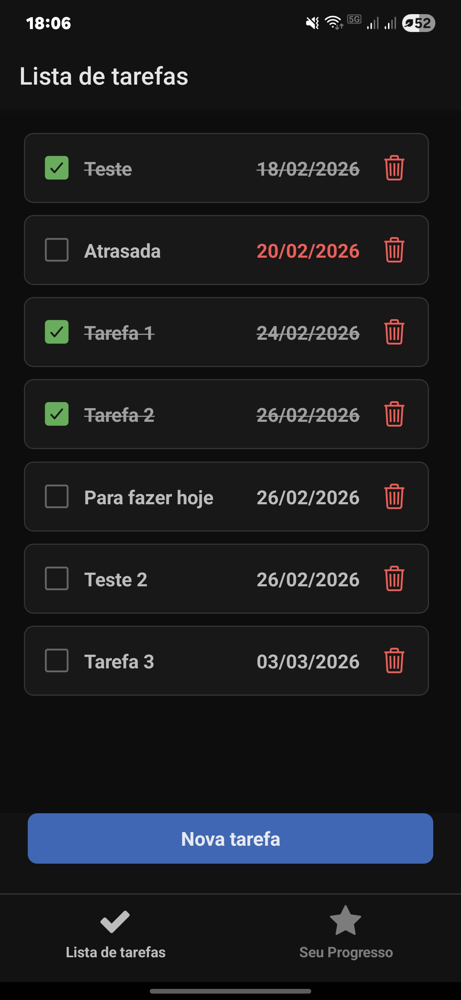

# **Aplicativo de lista de tarefas**
Aplicativo desenvolvido com React Native, que permite a inclusão, alteração, consulta e exclusão de tarefas (armazenamento local com AsyncStorage). Também exibe o número de tarefas realizadas, pendentes, atrasadas e com data para hoje, além de exibir a porcentagem de itens concluídos.

  
  
  

